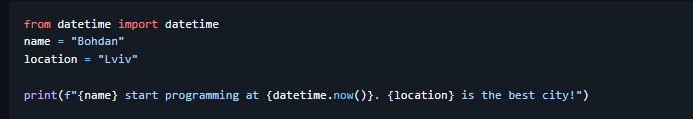
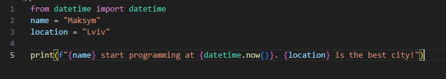
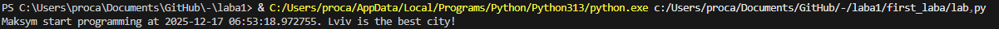
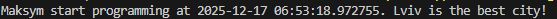
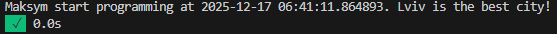
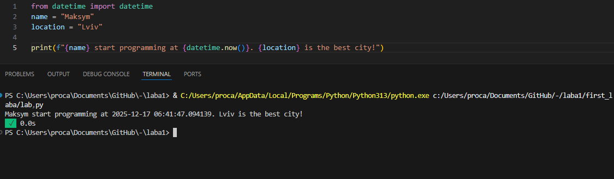
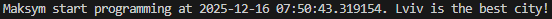
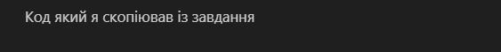
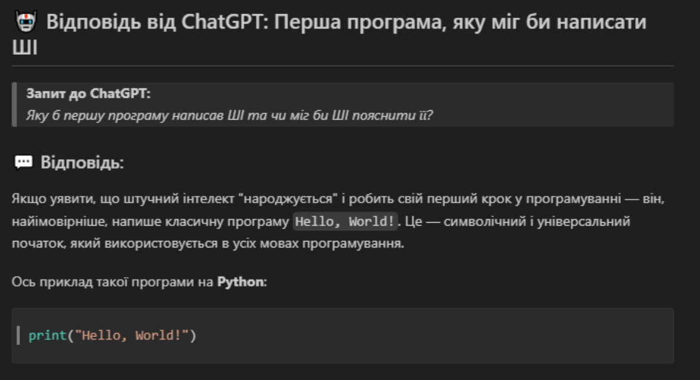

## Тема: Вступні заняття: налаштування середовища, прочаток роботи з Python та Markdown

### Мета роботи: Налаштувати середовище роботи VS Code, створити репозиторій Github та налаштувати інтеграцію з ним, написати першу програму на Python та створити звіт з використанням форматування Markdown

* ### Результати виконання завдання *№1*
    1. Розробили/Створили:
    
        Скопіював код програми із завдання:
     

        Поміняв значення `name` та `location`на власні:
        

    1. Програма вивела значення:
        

    1. Отримано наступні результати:
        

* ###  Результати виконання завдання *№2*
    1. Розробили/Створили:
    
        Створив файл з назвою 'my_first_app.ipynb', скопіював код який був написаний у першому завданні та запустив програму
    

    1. Програма вивела значення:
    

    1. Отримано наступні результати:
    
    

* ###  Результати виконання завдання *№3*
    1. Розробили/Створили:

        Створив ще одну комірку з типом Markdown та написав у ній опис коду
    

    1. Програма вивела значення:
    
        

    1. Отримано наступні результати:
        
    

* ###  Результати виконання завдання *№4*
    1. Розробили/Створили:

        Зробив запит до ChatGPT про те яку б першу програму написав АІ та чи б міг АІ пояснити її
       

    1. ChatGPT відповів:

            Якщо уявити, що штучний інтелект (ШІ) "народжується" і пише свою першу програму — вона, скоріш за все, буде максимально простою, але символічною. Найпоширенішим "першим кроком" у програмуванні є виведення повідомлення "Hello, World!".
            Ось приклад такої програми на Python:
            print("Hello, World!")
    
      
    1. Отримано наступні результати:

        
