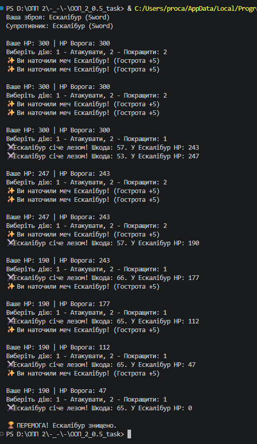

# Звіт до роботи (Завдання 2)

**Тема:** Парадигми ООП: Абстракція, Наслідування, Поліморфізм та Інкапсуляція.

**Мета роботи:** Практично застосувати ключові принципи об'єктно-орієнтованого програмування на Python для побудови гнучкої та розширюваної архітектури програми на прикладі текстової бойової гри.

## Виконання роботи
В ході виконання завдання було розроблено консольну гру за такими принципами ООП:

1. **Абстракція:** Створено абстрактний базовий клас `Item` за допомогою модуля `abc` з абстрактними методами `attack()` та `boost()`.
2. **Наслідування та Поліморфізм:** Реалізовано три класи-наслідники: `Sword`, `Axe` та `Bow`. Кожен з них по-своєму реалізує логіку атаки (зі своїми діапазонами шкоди) та покращення зброї.
3. **Інкапсуляція:** Базові характеристики та внутрішні модифікатори (наприклад, гострота меча `_sharp` чи базова сила `__attack_power`) приховані всередині класів.

**Лог успішного ігрового процесу в терміналі:**
*(Скріншот виконання гри додано нижче)*

## Висновок:
1. **Що зроблено:** Реалізовано ігрову логіку боївки між гравцем та комп'ютером за допомогою поліморфних викликів методів.
2. **Результат:** Програма працює стабільно, ігровий цикл коректно опрацьовує кроки, підраховує HP та завершує гру при досягненні 0 HP.
3. **Отримані знання:** Закріплено навички роботи з абстрактними класами, викликом конструктора суперкласу через `super().__init__()` та обробкою дій супротивника через генерацію випадкових чисел.